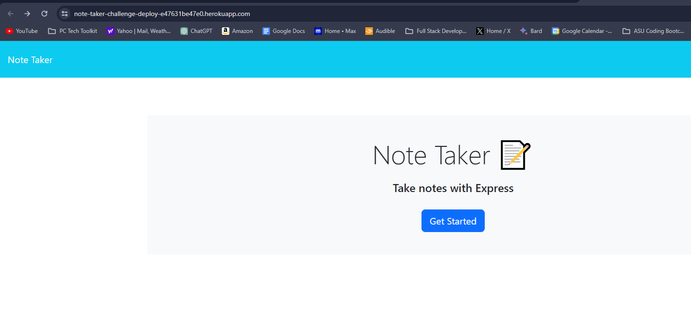
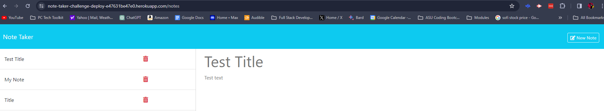

# Note Taker App

## Description
I was motivated to build this application so I can have a centralized location for writing and storing notes. I built this project to practice writing server-side with express and client-side code. I learned about the creation process of a full-stack application and deploying an application using Heroku. 

## Installation
To install this application, clone the repository and run 'git clone' in your terminal.

## Usage
To use this application, navigate to the below URL:

Homepage

Notes
